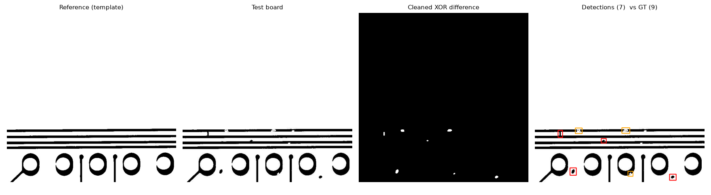

# PCB Defect Inspector

Automated optical inspection (AOI) for printed circuit boards, using classical image processing.
The tool compares a photo of a board against a known-good "golden" reference, finds every place
they differ, and reports each difference as a defect. The results are then fed into a
statistical process control (SPC) chart.



*Left to right: reference board, board under test, cleaned difference mask, detected defects.*

---

## Table of contents

1. [Features](#features)
2. [How it works](#how-it-works)
3. [Results](#results)
4. [Project layout](#project-layout)
5. [Setup](#setup)
6. [Running the project](#running-the-project)
7. [Using the web demo](#using-the-web-demo)
8. [Configuration reference](#configuration-reference)
9. [Testing](#testing)
10. [Dataset and credits](#dataset-and-credits)

---

## Features

- **Reference-vs-test defect detection** using thresholding, XOR differencing, morphology and connected components
- **Optional ECC image alignment** for photos that are shifted or slightly rotated relative to the reference
- **Quantitative evaluation** on the DeepPCB benchmark: precision, recall, F1, per-defect-type recall and time per image
- **SPC c-chart** of defects per board, with 3-sigma control limits and out-of-control flagging
- **Streamlit web demo** to upload a reference/test pair and inspect the result interactively
- **Unit tests** covering detection, evaluation matching and the SPC logic
- **Fast:** about 7.5 ms per 640x640 image without alignment

## How it works

Each stage is a small, separate step, which makes the pipeline easy to explain and to tune.

| # | Stage | What it does | Why |
|---|-------|--------------|-----|
| 1 | Alignment (optional) | ECC (enhanced correlation coefficient) registration of the test image onto the reference | Removes camera shift and rotation so identical features overlap |
| 2 | Binarization | Gaussian blur, then Otsu thresholding, so copper is white and background is black | Makes the comparison robust to brightness changes |
| 3 | XOR difference | Marks every pixel where the two binary images disagree | Leaves only the differences |
| 4 | Morphological opening | Removes thin 1-2 px slivers (default 5x5 kernel) | Edge misregistration creates thin lines that are not real defects |
| 5 | Morphological closing + connected components | Merges nearby fragments and labels each blob | One defect becomes one box |
| 6 | Filtering and labeling | Drops blobs below a minimum area, labels each `missing_copper` or `extra_copper` | Removes noise and adds a simple defect category |
| 7 | SPC | Counts defects per board and plots them on a c-chart | Turns per-image results into a process-level signal |

**c-chart limits:** center line = mean defects per board (c̄), upper control limit = c̄ + 3√c̄,
lower control limit = max(c̄ - 3√c̄, 0). Boards outside the limits are flagged.

## Results

Evaluated on the DeepPCB test split (499 image pairs). A detection counts as correct when its
bounding box overlaps a ground-truth defect with IoU of at least 0.3.

| Mode | Precision | Recall | F1 | Time per image |
|------|-----------|--------|----|----------------|
| Default (no alignment) | 0.842 | 0.872 | 0.857 | ~7.5 ms |
| ECC alignment (first 100 pairs) | 0.931 | 0.854 | 0.891 | ~390 ms |

Recall by defect type (default mode):

| Defect | Recall | Samples |
|--------|--------|---------|
| copper | 0.978 | 464 |
| spur | 0.921 | 483 |
| short | 0.910 | 478 |
| pin-hole | 0.857 | 470 |
| open | 0.853 | 659 |
| mousebite | 0.751 | 586 |

Mousebites are small and shallow, so they are the hardest defect for this approach.
Raw output of the full evaluation is saved in `assets/results_test_split.txt`.

## Project layout

```
PCB-Defect-Inspector/
├── app.py                    # Streamlit web demo
├── requirements.txt          # Python dependencies
├── README.md                 # This file
├── .gitignore
├── assets/
│   ├── pipeline.png          # Four-panel pipeline example (used in this README)
│   ├── c_chart.png           # SPC c-chart across boards
│   └── results_test_split.txt  # Saved evaluation output
├── pcbinspect/               # Core library
│   ├── __init__.py           # Public API (detect_defects, Detection, DEFECT_NAMES)
│   ├── detect.py             # Alignment, binarization, differencing, filtering, drawing
│   ├── dataset.py            # DeepPCB loader (reference, test, ground-truth boxes)
│   ├── evaluate.py           # IoU matching, precision/recall/F1, timing
│   └── spc.py                # c-chart control limits and out-of-control detection
├── scripts/
│   ├── run_eval.py           # Command-line evaluation on DeepPCB
│   └── make_figures.py       # Regenerates the figures in assets/
└── tests/
    └── test_pipeline.py      # Unit tests
```

## Setup

### Requirements

- Python 3.10 or newer
- About 200 MB of disk space for dependencies and about 1 GB for the dataset clone

### 1. Get the code

Clone or download this repository and open a terminal in its root folder.

### 2. Create and activate a virtual environment

Windows (Command Prompt):
```bash
python -m venv .venv
.venv\Scripts\activate
```

Windows (PowerShell):
```powershell
python -m venv .venv
.venv\Scripts\Activate.ps1
```

macOS / Linux:
```bash
python3 -m venv .venv
source .venv/bin/activate
```

Your prompt should now start with `(.venv)`.

### 3. Install dependencies

```bash
pip install -r requirements.txt
```

### 4. Download the DeepPCB dataset

Place it next to the project folder so the paths below work as written:

```bash
git clone https://github.com/tangsanli5201/DeepPCB.git
```

Without git, download the ZIP from the DeepPCB GitHub page and unzip it. The folder name will
be `DeepPCB-master`; use that name in the commands below instead of `DeepPCB`.

Expected layout:

```
Projects/
├── PCB-Defect-Inspector/
└── DeepPCB/
    └── PCBData/
        ├── group00041/
        ├── ...
        ├── trainval.txt
        └── test.txt
```

The `--data` argument must point to the folder that **directly contains** `PCBData`.

## Running the project

All commands are run from the project root with the virtual environment active.

### Evaluate on DeepPCB

```bash
python scripts/run_eval.py --data ../DeepPCB
```

Prints precision, recall, F1, true/false positives, false negatives, average time per image and
recall for each defect type. Useful variations:

```bash
python scripts/run_eval.py --data ../DeepPCB --limit 100   # first 100 pairs only (quick check)
python scripts/run_eval.py --data ../DeepPCB --align       # enable ECC alignment (slow)
python scripts/run_eval.py --data ../DeepPCB --min-area 40 --open-ksize 5
```

### Generate figures

```bash
python scripts/make_figures.py --data ../DeepPCB
```

Writes `assets/pipeline.png` and `assets/c_chart.png`, and prints `figures written; OOC boards: [...]`
on success. An empty list means no board crossed the control limits.

### Launch the web demo

```bash
streamlit run app.py
```
Then open the URL it prints (normally http://localhost:8501).

## Using the web demo

1. Upload a **reference** image and its matching **test** image. In DeepPCB, every board has a
   `_temp.jpg` (reference) and a `_test.jpg` (test) with the same number, for example
   `PCBData/group00041/00041/00041000_temp.jpg` and `00041000_test.jpg`.
2. The app shows the test board with boxes around defects, the cleaned difference mask, and a
   table listing each defect's box, area, type and score.
3. Adjust the sidebar controls to see how the parameters change the result.

Quick sanity checks: uploading the same image twice should report 0 defects, and the number of
boxes should be close to the number of lines in the matching ground-truth file
(`PCBData/group00041/00041_not/00041000.txt`).

## Configuration reference

| Parameter | Default | Where | Effect |
|-----------|---------|-------|--------|
| `align` / `--align` | off | `detect_defects`, `run_eval.py` | ECC alignment; more accurate on shifted photos, about 50x slower |
| `min_area` / `--min-area` | 25 px | same | Smallest difference blob kept; higher means fewer false alarms but more missed small defects |
| `open_ksize` / `--open-ksize` | 5 | same | Noise-removal kernel; larger removes more slivers but can erase small real defects |
| `merge_ksize` | 15 | `detect_defects` | Distance within which fragments are merged into one defect |
| `pad` | 6 px | `detect_defects` | Padding added around each detection box |
| IoU threshold | 0.3 | `evaluate.evaluate` | Overlap needed to count a detection as correct |

## Testing

```bash
pytest -q
```

The tests check that identical images produce no detections, that a synthetic copper bridge
between two traces is found, that IoU and matching behave correctly, and that the c-chart flags
an obvious spike.

## Dataset and credits

This project uses the **DeepPCB** dataset: 640x640 pairs of template and test PCB images with
bounding-box annotations for six defect types (open, short, mousebite, spur, copper, pin-hole).

> Tang, S., He, F., Huang, X., Yang, J. *Online PCB Defect Detector On A New PCB Defect
> Dataset.* arXiv:1902.06197, 2019.

Dataset repository: https://github.com/tangsanli5201/DeepPCB. Check its license before
redistributing any of its images.
